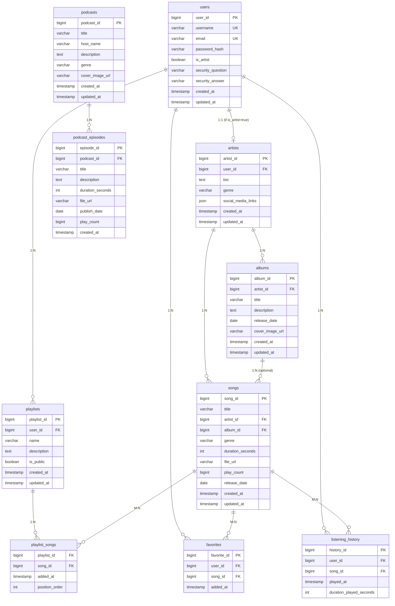

# RevPlay Database ERD

## Entity Relationship Diagram

## Database Relationships Summary

### Core Entities:
- **Users**: Base table for all users (listeners and artists)
- **Artists**: Extended profile for users who are artists
- **Songs**: Individual music tracks
- **Albums**: Collections of songs by artists
- **Podcasts**: Podcast shows
- **Podcast Episodes**: Individual episodes within podcasts
- **Playlists**: User-created song collections
- **Favorites**: User's favorite songs
- **Listening History**: Track user's listening activity

### Key Relationships:
1. **User-Artist**: 1:1 relationship (only users with is_artist=true have artist profiles)
2. **Artist-Song**: 1:N relationship (artists can have multiple songs)
3. **Artist-Album**: 1:N relationship (artists can have multiple albums)
4. **Album-Song**: 1:N relationship (albums contain multiple songs, optional for singles)
5. **User-Playlist**: 1:N relationship (users can create multiple playlists)
6. **Playlist-Song**: M:N relationship (playlists can contain multiple songs, songs can be in multiple playlists)
7. **User-Favorite**: M:N relationship (users can favorite multiple songs, songs can be favorited by multiple users)
8. **User-Listening History**: M:N relationship (users can listen to multiple songs, songs can be listened by multiple users)
9. **Podcast-Episode**: 1:N relationship (podcasts have multiple episodes)

### Constraints:
- All foreign key relationships have proper CASCADE/SET NULL rules
- Unique constraints on usernames, emails, and user-song favorite combinations
- Proper indexing for performance optimization
- Timestamp tracking for audit trails

### Data Integrity:
- Users must exist before creating artist profiles
- Artists must exist before creating songs/albums
- Songs can exist without albums (singles)
- Playlists must belong to existing users
- All junction tables maintain referential integrity
